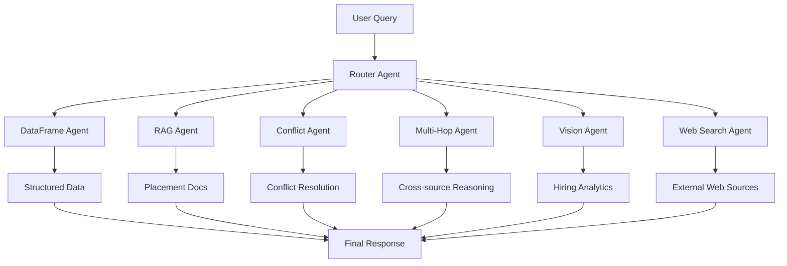
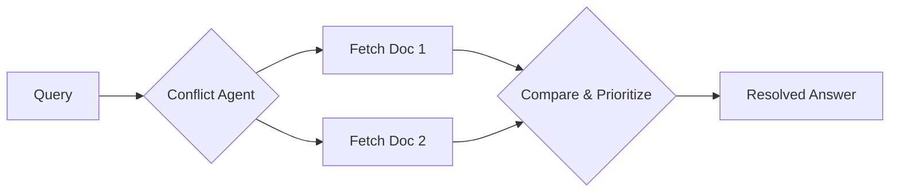
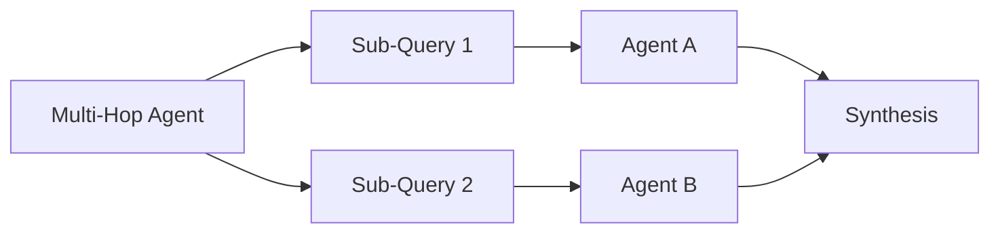
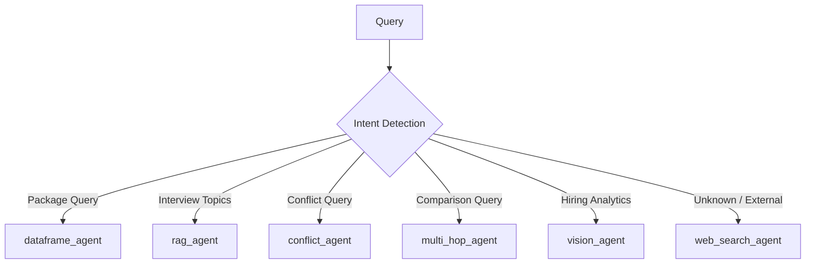
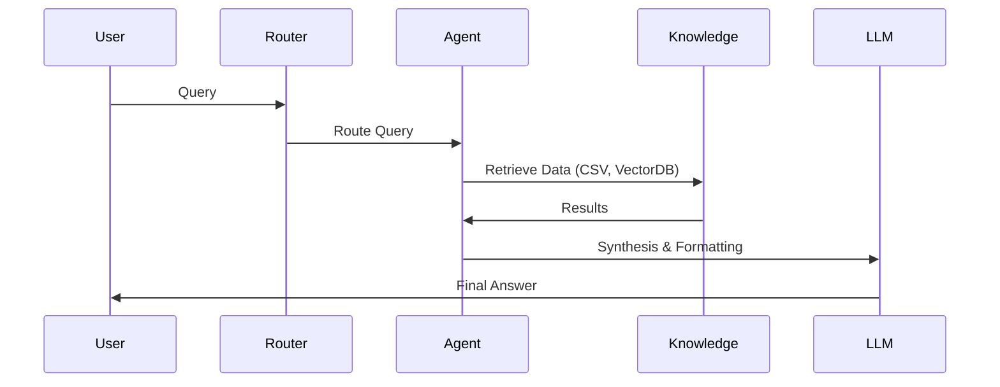

<div align="center">

# 🎓 Agentic RAG Placement Intelligence Assistant

*Intelligent, Multi-Agent Retrieval-Augmented Generation for Campus Placement Queries*

[](#)
[](#)
[](#)
[](#)
[](#)

</div>

<br/>

The ** RAG Placement Intelligence Assistant** is a state-of-the-art AI system designed to answer complex placement-related queries. It seamlessly unifies structured tabular reasoning, advanced textual Retrieval-Augmented Generation (RAG), multi-hop synthesis, conflict resolution, and vision-based hiring analytics to provide exact, grounded, and highly formatted intelligence. 


## 🛑 Problem Statement

Traditional placement portals and PDFs are frustratingly difficult to navigate. When students ask questions like *"What is the package offered by Google?"* or *"How many SDE roles does Amazon hire compared to Microsoft?"*, they are forced to manually cross-reference conflicting PDFs, spreadsheets, and emails.

This system eliminates information friction. By applying intelligent reasoning to structured and unstructured data sources, it empowers students and placement officers with immediate, highly accurate answers without hallucination.

---

## 🧠 System Overview

This system is built on an **Agentic RAG architecture**. Rather than relying on a single monolithic LLM prompt, it uses a high-confidence semantic router to delegate queries to specialized reasoning agents.



---

## 🤖 Agent Architecture

### 📊 dataframe_agent
Used for deterministic structured reasoning on tabular datasets. It executes Python code internally to perform filtering, sorting, threshold logic, and direct table lookups.
**Use Cases:**
- Direct package lookups (*"What is the package offered by Google?"*)
- Backlog eligibility (*"How many backlogs does Deloitte allow?"*)
- Bond period queries (*"What is the bond period for Amazon?"*)

### 📄 rag_agent
Powered by highly optimized vector search, this agent retrieves context from textual documents like placement guidelines, interview experiences, and preparation topics.
**Use Cases:**
- Interview rounds (*"What are the interview rounds for TCS?"*)
- Preparation topics (*"How do I prepare for Microsoft?"*)

### ⚔️ conflict_agent
Identifies and resolves contradictions across different data sources using defined priority rules.
**Example Logic:**
> **Amazon CGPA Constraint**
> Official Document → 6.4 
> Portal → 7.0 
> *Resolution:* Official source overrides Portal.



### 🧠 multi_hop_agent
Executes multi-step reasoning by decomposing complex queries, routing sub-queries to other agents, and synthesizing a final unified response.
**Use Cases:**
- Package-to-CGPA ratio calculations
- Cross-company comparisons
- Synthesis of eligibility and hiring trends



### 👁️ vision_agent
Extracts data from unstructured visual artifacts like charts, hiring distributions, and graphs to answer analytical queries.
**Use Cases:**
- Visual table understanding
- Hiring trend analysis

### 🌐 web_search_agent
Acts as the ultimate out-of-corpus fallback when information cannot be found in internal datasets.
**Use Cases:**
- *"TCS campus visit date 2024"*

---

## 🔀 Query Routing Logic

The system utilizes an intent-detection router with deterministic overrides and fallback confidence scoring.



- **Confidence Scores:** The router evaluates the query against agent capabilities and assigns confidence probabilities.
- **Overrides:** High-priority keyword triggers explicitly bypass LLM routing for maximum determinism on critical queries.

---

## 🛠️ Techniques Used

### Structured Reasoning
- Deterministic filtering and sorting 
- Threshold logic execution
- Boolean entity evaluation

### Retrieval-Augmented Generation (RAG)
- ChromaDB vector embeddings
- Semantic chunking & retrieval
- Context-aware text synthesis

### Multi-Hop Reasoning
- Query decomposition and chaining
- Sub-agent delegation
- Inter-domain aggregation

### Conflict Resolution
- Source prioritization strategies
- Automated cross-verification logic

### Agentic Routing
- Zero-shot semantic classification
- Deterministic regex overrides
- Fallback intelligence handling

---

## 📂 File Structure

```text
Hackathon_RAG/
│── app/
│   ├── agents/
│   │   ├── dataframe_agent.py
│   │   ├── rag_agent.py
│   │   ├── conflict_agent.py
│   │   ├── multi_hop_agent.py
│   │   ├── router_agent.py
│   │   ├── vision_agent.py
│   │   └── web_search_agent.py
│   │
│   ├── chunking/
│   ├── config/
│   ├── embeddings/
│   ├── ingestion/
│   └── tools/
│
│── data/
│   ├── processed/
│   └── raw/
│
│── frontend/
│
│── tests/
│   └── test_agents.py
│
│── main.py
│── requirements.txt
│── run_tests.py
└── README.md
```

- `agents/`: Contains the specific autonomous agents.
- `router/`: Houses the intent classification and dispatch logic.
- `tools/`: Python sandbox evaluation, calculators, and API interfaces.
- `tests/`: Extensive automated benchmark and regression tests.

---

## 🏆 Benchmark Coverage

Our architecture rigorously passes an extensive internal placement benchmark suite:

| Benchmark | Type | Status |
| --------- | ---- | ------ |
| **E1 - E8** | Easy Direct Lookups (Bond, Package, Tech, Boolean) | ✅ PASS |
| **M1 - M6** | Medium Filtering & Comparison (Constraints, Thresholds) | ✅ PASS |
| **H1 - H8** | Hard Multi-hop & Synthesis (Conflicts, Analysis) | ✅ PASS |

*All 60/60 unit tests pass flawlessly on deterministic evaluations.*

---

## ⚙️ Execution Flow



---

## 🚀 Installation

Follow these steps to deploy the intelligent assistant locally.

```bash
# 1. Clone the repository
git clone https://github.com/your-username/Hackathon_RAG.git
cd Hackathon_RAG

# 2. Install dependencies
pip install -r requirements.txt

# 3. Configure Environment Variables
cp .env.example .env
# Add your LLM keys in the .env file

# 4. Start the Application
python main.py
```

---

